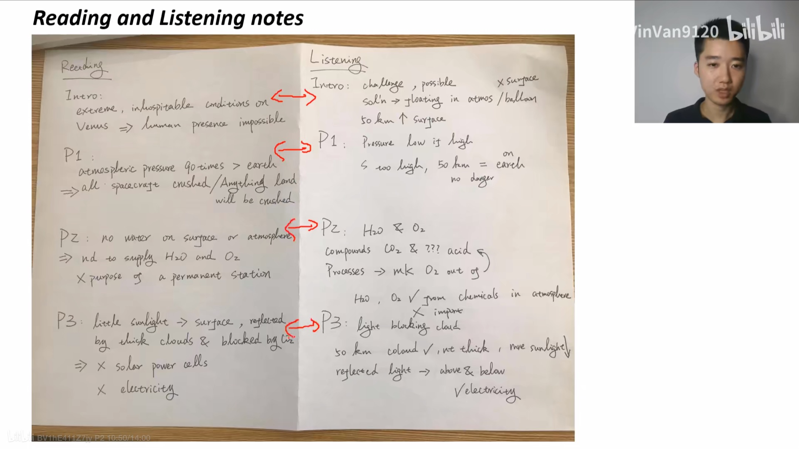
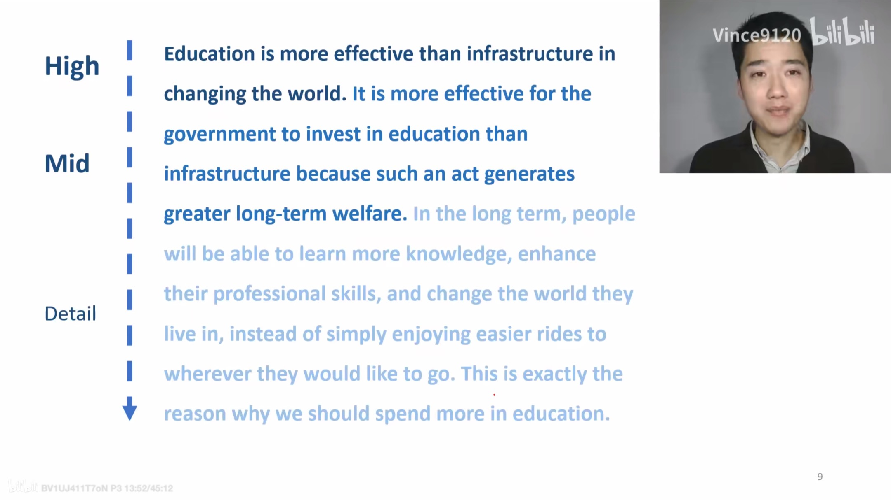
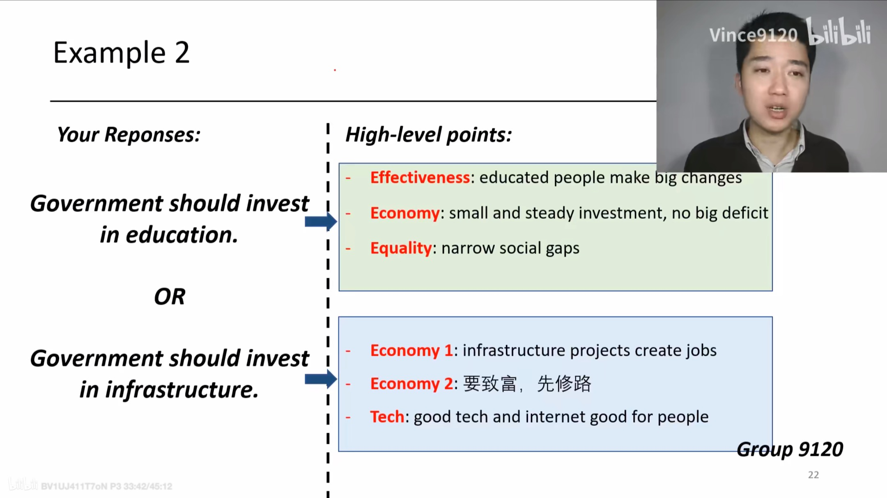
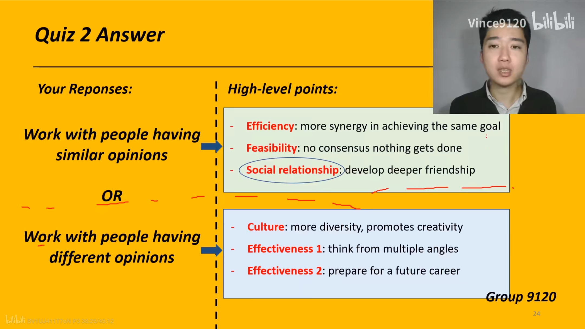
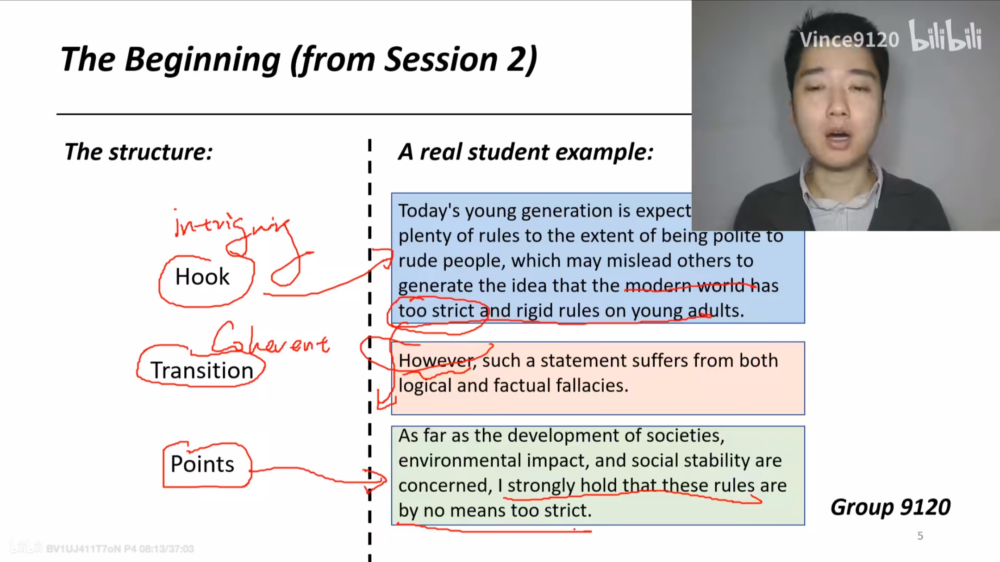

# TOEFL Writing

[TOC]

## Integrated Writing

3 min reading, listening, 20 min writing（写作时，阅读原文会出现，听力材料只能听一次）
精确地提取信息并把阅读和听力中的信息并到一起。不要求太多思考
**CONTENT and COHERENCE** matters the most
NOT the place to show off language skills

### Three question styles

- Opposition
- Problems and solutions
- Solutions and Problems

The Lecture **ALWAYS OPPOSES** the article
Reading and Listening Structures

**Prep work: 记下阅读和听力的Intro和P1，2，3（Point）**
最开始在一张纸两半上分别写R和L的Intro, Point 1, 2, 3
3 min记下笔记

1. Record the main idea of intro and each point//只记下段首不够，不能完全抄段首
2. Establish a coherent summary of each point//
3. Skim through the details in each point//

Listening analysis and notes-taking

1. Have an EXPECTATION for the main idea
2. Capture the MAIN IDEA
3. Capture as many DETAILS as you can

### Note-taking

### The Writing Structure

>*(Intro)* In the reading material, the author <u>cites three reasons to support his/her viewpoint</u> that *(summary of reading intro)*. Nevertheless, the lecturer in the listening material <u>argues that</u> *(summary of listening material)*, and <u>opposes the points</u> in the reading material.
**First and foremost**, the author <u>argues that</u> *(reading point 1 + cause and effect)*. However, the lecturer <u>offers an opposite stand</u> that *(listening point 1 + details)*.
**In addition**, the lecturer <u>casts doubt on the author's another reason</u> that *(reading point 2 + cause and effect)*, <u>demonstrating that</u> *(listening point 2 + details)*.
**Finally**, the author's third reason that *(reading point 3 + cause and effect)* is also <u>counteracted by the lecturer who points out that</u> *(listening point 3 + details)*.

Putting Everything together
规则 >=250字，阅读/听力 1/1.5-1/2，20min
笔记：阅读和听力平行写下
**例：TPO 40 IntW**
>In the reading material, the author cites three reasons to support the viewpoint that the conditions on Venus are too extreme and inhospitable, which makes permanent human presence on Venus impossible. Nevertheless, the lecturer in the listening material argues that constructing a floating station 50km above the surface of Venus would overcome the challenges, and opposes the points in the reading material.
First and foremost, the author argues that *the atmospheric pressure on Venus is 90 times that of Earth and will crush any spacecraft that land on it. However, the lecturer offers an opposite stand that although the atmospheric pressure is too high on the surface of Venus, it is much low at a high altitude – 50 km above surface. At this level, the pressure is about the same as that on Earth, and poses no danger.*
In addition, the lecturer *casts doubt on the author's another reason that there is no water on the surface or in the atmosphere of Venus, so the purpose of a permanent station is defeated as water and oxygen need to be supplied from Earth*; the lecturer *also demonstrates that water and oxygen can be made out of chemical compounds from Venus’s atmosphere. Compounds such as carbon dioxide and a certain acid can be processed to produce oxygen and water, and thus there is no need to import them from Earth.*
Finally, the author's third reason that *little sunlight reaches Venus’s surface (blocked by thick clouds and CO2) makes generating electricity from solar power cells impossible* is also counteracted by the lecturer who points out that *at 50 km above Venus’s surface, cloud is not as thick as on the surface. In addition, at this height there is also more reflected light from clouds above and below*. Therefore, adequate electricity can be generated to power the floating station.

### Key Takeaways

1. MODIFY and MEMORIZE your own writing structure.
2. Convey the main ideas before diving into details.

Punctuations can help you a lot in writing. (dash-  semicolon;)

## Independent Writing

30min writing

### Question Style

1. **Agree/Dis-**
2. **Multiple Choices** (3或4选1)
3. **Preference** (Which do you prefer) 与agree/dis-相似
4. **Scenario** 本质还是agree/dis-

**The four Dimensions:** Topic, Topic development, Unity, Language
**2019年的变化**： 更加啰嗦。DO NOT USE MEMORIZED EXAMPLES 这个要求实际上没啥用，用模板仍然可以。

### The Structure

#### Key elements

- Five Paragraphs
- **450+**, preferable 500+ words (考试时有字数)
- A logical cohesive and idiomatic arrangement in an academic style.

#### Template (Writing structure)

1. The beginning
2. Point 1 + Reasoning（道理）
3. Point 2 + Exempliication（例证）
4. Point 3 + Concession（欲扬先抑，指出对手观点的问题）
5. The end

### Prompt Analysis and Brainstorming

先从一边写（不要写两个观点，辨证判断比较难）
不要只从一个角度讨论

**A reservoir of high-level points**
（观点库，万能观点，宏观，可扩展，兼容性好）

- Effectiveness and efficiency
- Economy and finance
- Environment and health
- Equality and fairness
- Feasibility and compatibility
- Culture and globalization
- Technology and internet

从大观点，解释，到细节可以组成一个段落

**Prompt analysis and response**
**Agree/dis-**
两问选一个
**Multiple choices**
若题目中有most important，不要证明most，先解释为什么important，然后解释
**Preference**
（与Agree/dis）相似
**Helpful Tips**

1. 选那一边不重要
2. 不要受细节限制
3. 无需从所有方向证明

**Some Examples**

**In a word**, brainstorm需要**多练习**

### P1 Opening

A good opening is **intriguing, cohernt and clear**.
分为：**Hook, transition, points**

根据Structure的内容，可以推导出Opening的结构
>*(Hook)，用对方的事实* It is hard to deny that (opposite point), and such a fact leads impressionable people to generate the opinion that (opposite opinion).
*(Transition)，过渡到自己的立场，教对方做人* However, such a statement suffers from both logical and factual fallacies, and it should be examined meticulously.
*(Points)，写出各个方面* As far as (Pont 1), (Point 2), and (Point 3) are concerned, I strongly hold that (your opinion).
>**e.g.**
>**It is hard to deny that** infrastructure projects can create jobs for a society, and **such a fact may mislead impressionable people to generate the opinion** that our government should give priority of its investment to infrastructure instead of education.
However, such a **statement suffers from both logical and factual fallacies, and it should be examined meticulously**.
**As far as** effectiveness, economy, and equality **are concerned**, I strongly hold that our government should divert its investment to education.

P.S. 可以改进给出的结构

### P2 Reasoning

要求： coherent, adequete, consistent
>**First and foremost**, it is necessary for the young to follow rules. It is not only a good individual behavior but also demonstrating an average level of the social atmosphere. Even though people may show bad attitude to others, we still need to make sure our own politeness. **Meanwhile**, with the development of societies, many people are allowed to demonstrate their own preference. **For example**, wearing some seemingly odd clothes, coming out of the closet and so on, which is prevented by both the people and the government in the past.

**如何解决写不下去的问题**
前文如下
>Education is more effective than infrastructure in changing the world, as education generates greater long-term welfare for the society we live in.
Meanwhile, In the long term, people will be able to learn more knowledge, enhance their professional skills, and change the world they live in;

- Version 1 **Follow** 对写出来的内容进行挖掘。问自己各种问题。比如说learn what knowledge? etc.
    >**Furthermore**, people that are well-educated tend to place a heavy emphasis on their future generations as well, and thus a virtuous cycle is formed in the whole society.
- Version 2 **Fight** 攻击反面观点。
    >**On the other hand**, an investment in infrastructure might give people an easier ride or faster internet, but it hardly enhance the inner quality of the whole society.
- Version 3 **Follow and fight** 说自己好的同时打反方观点的脸
    >Not to mention the fact that these highly educated citizens will be able to build better, stronger, and **more efficient infrastructure** in the future to serve the whole society.

**Optional Fillar**：字数不够时候来充字数，有**summary**和**what if**
>*(summary)* Therefore, the extent of the benefit of education is clear even to the layman’s eyes, and our government should place a heavy emphasis on the investment in education.
>*(what if)* If we do not place enough weight on education, we will lack momentum in our future development, not only in the building of infrastructure but many other fields as well.

### Exemplification

The formula
>Furthermore, the fact that (point 2 mid level) indicates that (point 2 high level).
Take the case of *(character)*, who / which *(process)*. As a result, *(result)*.
Had it not been for *(process paraphrase)*, *(character)* would never *(result paraphrase)*.

**Exemplification**
（经过不断改进）
>Furthermore, the fact that education promotes the fundamentals of economic growth in the long-term *(details)* indicates that the government should allocate resources to education.
Take the case of Soft Union, which once diverted a huge amount of fund to education in science and engineering. As a result, educated people, such as Tupolev, revolutionized the framework of Soft Union’s industry and economy. These talents formed a synergy and transformed a poor country into one of the leading economies in the world. *(Adequete)*
Had it not been for Soft Union’s heavy emphasis on education, Soft Union would never become a leading economy in the world.

### Concession（让步，欲扬先抑） and Ending

>Nevertheless, a voice arises that (opposite detail in grand opening).
Ironically, (fact(s) against opposite detail).
Therefore, (Point 3)

**Ending** 最后一段如果没有时间可以不用写，但平时练习的时候一定要写好。
>In a nutshell, I maintain that *(Your Response Paraphrase)*.
Admittedly, as my favorite quote from *(A famous person)* goes, *(Famous person says, “people have different opinions)*, and some people may oppose me.
However, I believe they will compromise after being exposed to my article.

比如
>In a nutshell, I maintain that our government ought to divert its financial resources to education.
Admittedly, as my favorite quote from James Madison goes, as long as the reason of man continues fallible, different opinions will be formed, and some people may oppose me.
However, I believe they will compromise after being exposed to my article.
