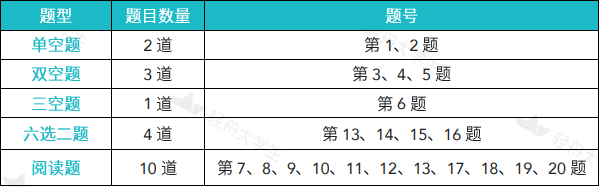
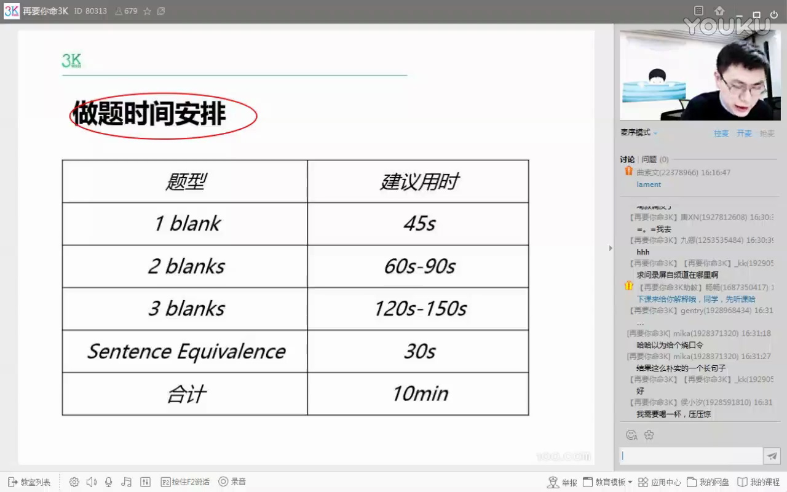
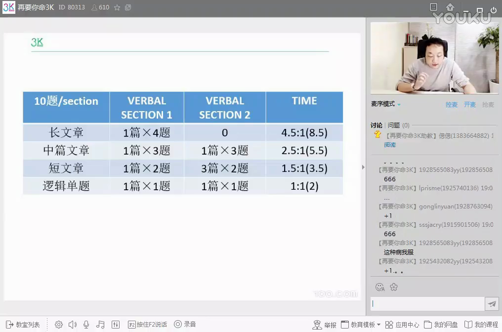
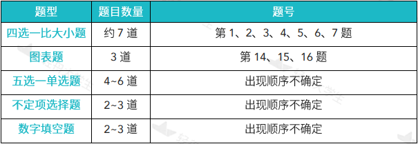
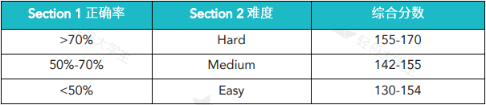

# GRE介绍
[TOC]
## 结构
- AW (Issue & Argument) 30+30 min
- VQVQV或QVQVQ
计分的只有两个V和Q，多出来的V和Q不计分（可能出现在任何位置）
其中V为Verbal Reasoning，包含20题（限时30min）
Q为Quantitative Reasoning，包含20题（限时35min）
第一轮 V-Q 或者 Q-V 部分结束之后，会有一个10 分钟的休息。
## Analytical Writing
题库在ETS官网已给出
[Pool of Issue Topics](https://www.ets.org/gre/revised_general/prepare/analytical_writing/issue/pool)
[Pool of Argument Topics](https://www.ets.org/gre/revised_general/prepare/analytical_writing/argument/pool)
## Verbal
填空题有单空、双空、三空、句子等价（六选二，两个是同义词），其中双空需要两个都对才能得分，三空也类似。

阅读之后的填空是六选二

推荐的填空时间安排如下

阅读的时间安排如下

## Quantitative
题量如下（对于中国学生比较简单）

## 计分
同科目V或Q内部，计分Section1难度中等Medium，但是计分Section 2的难度则是自适应的，大致按照以下逻辑组织
