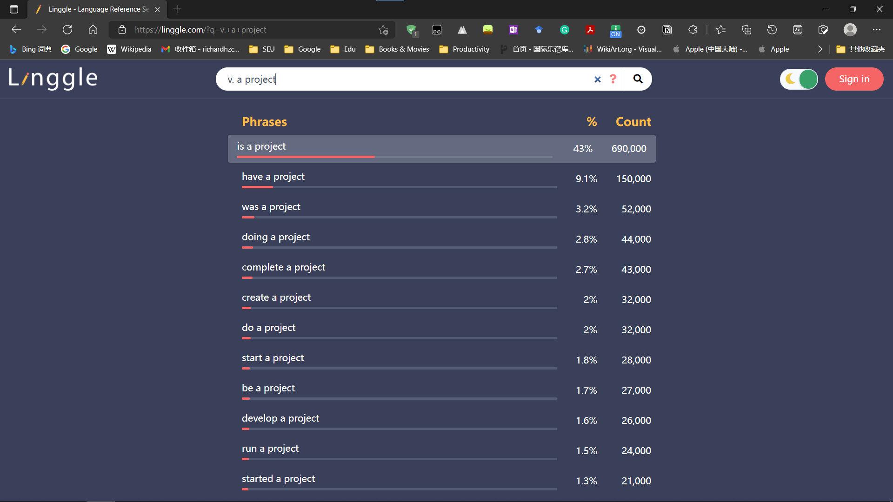

# English-Learning
Documents used during my preparation for TOEFL & GRE
## 一些体会
- **TOEFL**\
总体上来说，托福的难度并不大。我从2021年2月开始备考托福，到5月15日第一次考（102, 26+26+21+29）（遗憾的是口语不高，需要再考一次），并没有花费特别多的精力，也没报班（省了很多钱），只是2月花一个月左右时间背单词，然后3-5月在保证课内学习的情况下刷TPO。刚开始还是很痛苦的，毕竟当时听力只能对一半，一篇阅读全错是常有的事情，写作也很难下笔。不过多练，看看B站（强推up主Vince9120）的教学视频，和知乎上的一些指导，多看一些YouTube上的英文视频（找与托福材料内容相关的，比如科学类、历史类），正确率就上来了。SEU CS 大二下、大三上的课内任务还是很重的，课程难作业多，如果选课不当（选了作业太多的专业任选课）那就直接去世（bushi）。**有些人会推荐什么“精听”、“精读”这种花里胡哨的练习方法，如果你课内压力大，就不要考虑了**。至于写作，背个模板，到考场上改一些词就足够。
- **GRE**\
GRE的备考过程是极其痛苦的。在5月15考完托福后，我立刻开始背GRE单词。与托福不同，GRE单词大多很长，很生僻，还有很多的熟词生义。总而言之，GRE让人怀疑自己有没有学过英语。而GRE的题目更让人头秃（数学除外）：V (Verbal Reasoning) 题目的句子都很长，废话很多（考完GRE后我的说废话能力有了巨大提升），有些阅读题目的逻辑非常诡异。AW (Analytical Writing)方面，Issue并不像托福写作那样可以套模板，而是不同题目要用不同的套路。但除此之外，其他部分并不难，AW的Argument高度套路化，至于Q (Quantitative Reasoning)……大概就是中国的高中及以下数学的难度吧，满分很容易（但我这个憨批还是翻车了）。\
之前听说V部分虽然题目难度挺大，但想考到150+并不难；从我的亲身经历来看，或许确实是这样。我2021年10月31日在扬州大学考GRE，在这之前我的准备实在说不上充裕——5月中旬开始背单词，但因为这期间课业繁忙，又赶上期末考试，背的单词并不多，7月8月继续背单词、看从SEU飞跃群（留学交流群）里白嫖的网课视频，但由于单词难度太大，且当时暑期学校还有课程设计，而到了8月因为南京突发疫情，被困在学校上了4周大三的课，一天根本背不下来几个单词。8月，我每个周末做一些GRE题目，但由于时间太紧，经常无法完成。9月南京疫情结束，学校补暑假我回家，回家之后学习效率就下降了不少，每天大部分时间都在摸鱼。10月10日回到学校，回学校之后开始放弃课程来做GRE题目（除了经常quiz和lab的数图、两周一个lab的数据库、还有一堆lab的IT系统管理，这还是个任选课），同时我开始整篇练习AW（直到考试我才写了两篇Issue两篇Argument，但我写作也到了3.5），读再要你命黑书（《GRE写作高频题目及考点精析》）的范文。这期间，我的做题正确率不太稳定，10个填空有时候对8个，有时候对1个，但较高强度（实际上也没多高，我在备考期间甚至没熬夜）的练习确实让我的正确率得到了一定提高。**（补充：由于准备草率，我并没有留下多少能看的GRE的笔记，这个repo里面只有一个GRE介绍的markdown文档）**\
10月31日那天，我去考试。最开始考的是AW，由于训练不足，我打字比较慢而且经常打错，让我吃惊的是，**AW居然没有字数统计**，我记得我Issue刚写满整个屏幕，Argument写了整个屏幕多一点，且时间很紧。AW结束之后第一部分是数学（也就是说共有3个数学部分和2个语文部分，运气还不错），我记得数学部分有一个词不认识，还有一个图表题因为没看懂做了很长时间，其他都蛮顺利的。语文部分就不一样了，第一个V我差点没做完（最后两三个阅读几乎是瞎选的），第二个V难度比第一个稍小，我一度以为自己进入了Easy模式（这意味着V总分很难超过150了，必须重考），而且考试期间时不时的头疼，让我非常难受，自我感觉极差，我一度认为凉了。做完所有题目，微微颤抖着点了两次Report score之后，屏幕上出现了V和Q的分数：V156，Q166。我当时懵了，没想到这也能V 150+，还拿起笔算了一下156+166等于多少。然后就是点若干次的Confirm，离开考场，喘口气，自己运气还挺好。十天之后，我查到了写作分，3.5，应该是 Issue 3, Argument 4。在备考时间不算长、而且考试之前还发烧的情况下还能过 320+3.5 的线，不得不感叹自己运气极佳。而且，GRE想过线或许真的不难，虽然题目难度很大，虽然单词很难记。无论如何，一次搞定GRE这座大山让我非常高兴，毕竟备考过程实在是太费精力，太折磨人。以后应该不用再碰GRE这鬼东西了。\
不过，考完GRE一时爽，补之前欠下的课一直爽。
## 推荐的资源
**通用（除考试还可以用来帮助写文书）**
- 学会翻墙（略）
- 把手机电脑的操作系统语言换成英文
- [Merriam-Webster词典](https://www.merriam-webster.com/) 可以查近义词以及比较全面的英文解释
- [Etymonline](https://www.etymonline.com/) 可以查单词的词根词缀，对于GRE的长单词非常有用
- [Linggle](https://linggle.com/) 可以查用词搭配，如下图

- [COCA](https://www.english-corpora.org/coca/) (Corpus of Contemporary American English) 功能很多，可以看下知乎这篇文章了解 [知乎链接](https://zhuanlan.zhihu.com/p/28838654)
- [Grammarly](https://app.grammarly.com/) 可以查语法&拼写错误
- [z-lib](https://z-lib.org) 可以搜一些英文原版的电子书（P. S. 强烈推荐大家找一些英文原版的人文、历史、心理学等书籍，不仅能练英文阅读，还可以补充人文科学教育、熟悉西方那一套，进而看出国内与国外的差异，或者低情商的说法——差距）

**TOEFL**
- [B站Vince9120](https://space.bilibili.com/396671281/) （托福写作用了他的模板，然后29）
- 不背单词app（P.S. 背GRE单词最好不要用app，因为GRE单词很生僻，普通的背单词软件一般只有单词没有例句，而专为GRE单词设计的背单词软件不多且大多数很难用）
- YouTube一些英文视频（主要是听力和口语）
- [托福考满分](https://toefl.kmf.com/) 建议开会员，免费，联系助教即可，每周可以白嫖一张口语评分券&两张写作评分券

**GRE**
- Verbal Advantage 外国的书，但不太贵，大概70￥左右，听说不错，但我并没用……大家可以试试，据说可以帮助无痛背单词，如果不想看外国的书也可以看*再要你命3000*
- 再要你命黑皮书，全名《GRE写作高频题目及考点精析》，里面有一些比较有代表性的写作题目及范文
- GRE考满分 [链接](https://gre.kmf.com/)