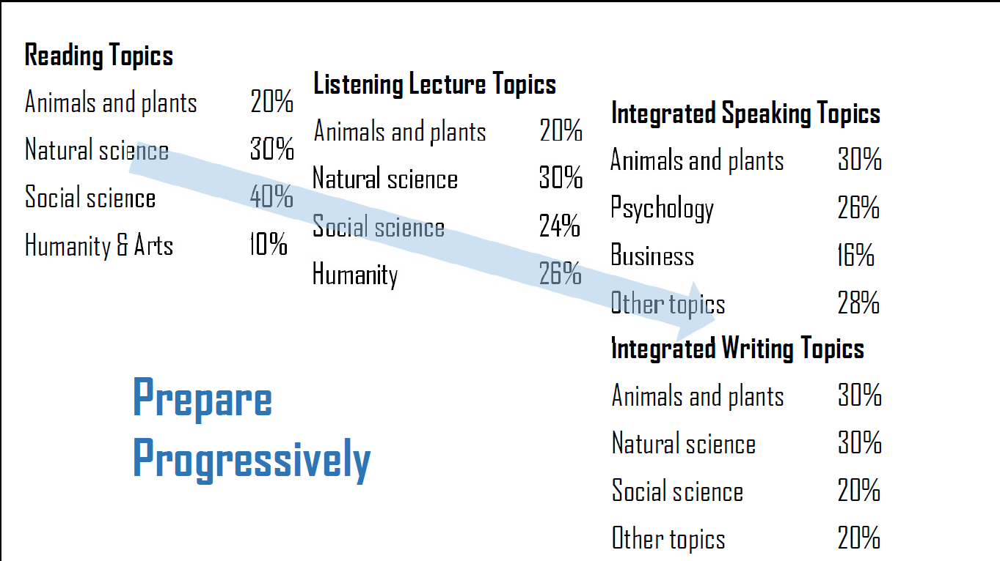
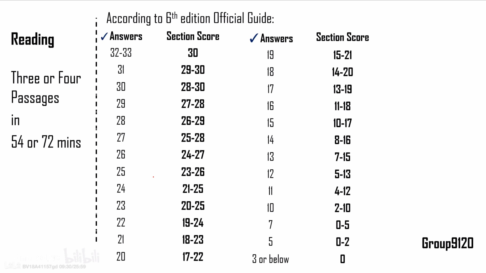

# TOEFL Reading

[TOC]

## Intro

3/4Passages, 54/72 mins（有加试的时候，加试不算分，但不知道哪个是加试）

平均下来每分钟70词（题目也很长）
错的题目越多，扣分越狠。

### Question Types

（括号中为example）

1. ==Factual Info==
   (According to paragraph 1, **which of the following is true** of the ETS?)
2. ==Not true / Except==
   (According to paragraph 2, all of the following statements about TOEFL are true **EXCEPT**)
3. ==Vocab==
   (The word “vehicles” in the passage is **closest in meaning to**)
4. ==Pronoun referral==
   (The word “it” in the passage **refers to**)
5. ==Inference==
   (Which of the following **can be inferred** from paragraph 5 about younger students?)
6. ==Purpose==
   (In paragraph 3, why does the author **provide the information that** 43% of parents believe TOEFL iBT is not the best evaluation tool for younger students?)
7. ==Sentence Analysis==
   (Which of the sentences below **best expresses** the essential information in the highlighted sentence in the passage? Incorrect choices change the meaning in important ways or leave out essential information.)
8. ==Cohesion==
   (Look at the four squares [] that indicate **where the following sentence could be added** to the passage.)
9. ==Summary==（6选3，3个2分，2个1分，其他0分，排在最后）
    (An introductory sentence or a brief summary of the passage is provided below. Complete the summary by **selecting the three answer choices that express the most important ideas in the passage**. Some sentences do not belong in the summary because they express ideas that are not presented in the passage or are minor ideas in the passage. This question is worth 2 points.)
10. ==Categorization==（少见，会出现在2个事物对比的阅读中）
    Select from the seven sentences below, the two sentences that **correctly characterize** TOEFL and the three sentences that correctly characterize IELTS. Drag each sentences you select into the appropriate column of the table. Two of the sentences will NOT be used. This question is worth 3 points.

## Procedure

Skimming -> Reading & Solving -> Summary (Q10)

## Skimming

Read and get an idea of the paragraphs without reading in full (1-2min).
需要关注段落中的实意词，重要的是反复出现的实意词得到段落的大意。**不能只读段首、段尾。可能被误导，段首可能只是一个到正文的过渡**
文章最后一段**不一定是总结**，可能是理论的局限性，对未来的影响etc

## Prob Solving

（以 TPO15 Task 1 A Warm blooded turtle 为例）

- Vocab
  认识单词就可以，也可上下文推断
- Inference 答案可能和原文要做一些联系
  比如 turtle **like** whale, turtle **swim into the cold** and **deals with the chilly waters** (passage) -> whale can swim in cold water -> whales' bodies are built in a way that helps them manage extremely cold temperatures (choice)
- Not true / Except
  需要语法分析
- Pronoun Referral
  注意it可能是向前指代而不是就近，不要凭借感觉，读上下文，并且zoom in on the part **before** the pronoun
- Factual info
- Sentence Simplification
  1. Segmentation
   注意分割，如果有分号可以分割
  2. Analysis
   找出主干成分、修饰成分（在哪里、形容词、目的etc）
  3. Simplification
  4. Logic
   找出逻辑关系（因果、陈述、并列）
  5. Matching
- Purpose
  结合上下文看出功能，总结上下文
- Factual info
  一个一个读答案选项并和原文匹配。
- Cohesion
  读懂四个方框周围的内容
- Summary
  原文给到的总结句（在题目最开始）的关键词和选项做匹配。排除一些非常明显的错误（根据自己对原文的理解）。回到原文检查答案是否正确。
  注意Minor Details，大多正确，转写原文的一些细节但无法总结整段（出现少）
