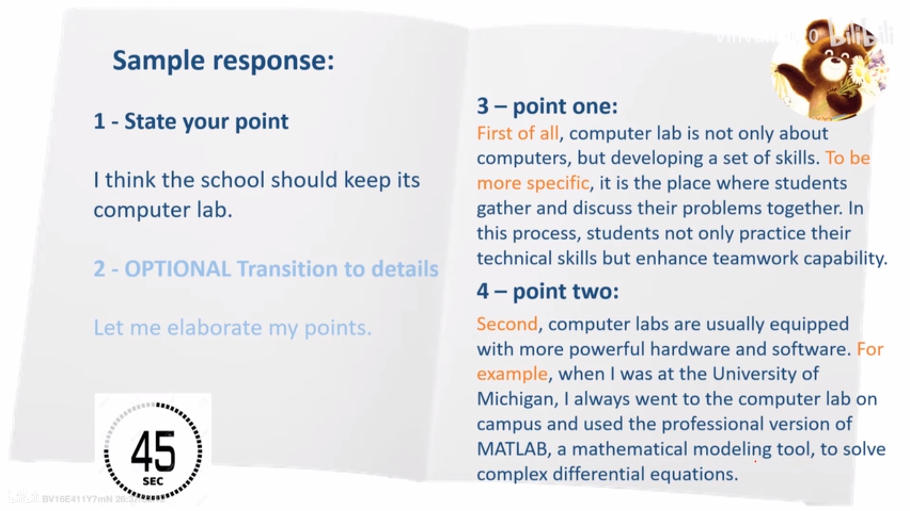

# TOEFL Speaking

[TOC]

第 1 道题是独立口语任务，题目内容涉及考生熟悉的话题。这道题要求考生依据自己的想法、观点和个人经历作答，也可利用任何与题目有关的想法、观点或经历来回答。
另外 3 道题是综合口语任务。回答这类题时，考生必须综合利用多种语言技能。要求考生首先读，听，然后用口语作答。考生可以记笔记，并利用这些笔记回答问题。

**评分机制**
人50% + Speech Rater 50%
人：delivery, language use, topic development
Speech Rater: fluency, grammar, vocabulary

- ~~原Task 1：已删除~~
- Task 1：（Prep 15s Response 45s）
两种行为/情形/观点，哪种更合理
说明自己的选择并解释原因。要对问题的各个部分做出全面的回答，对自己的观点十分清楚，并给出某个选择的理由
- Task 2：（Reading 45s Listening, Prep 30s Response 60s）
短文：校园生活相关，对话：两人讨论该话题并给出观点（支持或反对）。
题目要求陈述某一个人的观点和原因
- Task 3：（Reading 45s/50s Listening, Prep 30s Response 60s）
短文：学术性短文（对某内容下了定义），讲座：谈到与此相关的具体例子或反例。
题目要求运用讲座中的例子解释文中的内容
- ~~原Task 5：已删除~~
- Task 4：（Listtening, Prep 20s Response 60s）
听一段学术类讲座节选
题目要求运用讲座中的观点和例子来说明其中的主要概念和问题

Graders**不会**因为模板扣分，并不需要给出自己的见解(Deep thinking is NOT required)

## Task 1

Agree/Dis-
Preference/opinion
Good idea?

第二阶段可以省略（语速慢的话），3和4可以颠倒。
还可以一个point一个example

**Response Structure**

**Guidelines**

- warm up before speaking up
- vary vocabulary 开头可以把题干内容改变
- **use transition phrases:** in general, thus, as a result, addition, furthermore etc.
- Use a mix of simple and complex expressions.

**Response Sample**
Agree/dis-

Preference

Good idea

## Task 2

**Structure**
Short reading of an announcement / article / letter published for a change for two reasons
Two students talk about the reading: One will agree/dis- (very rarely have mixed opinion about the change), the student will specifically point to the two reasons in the reading.
话题：学校设施、调课、课外活动

**Response Structure**

**Guidelines**

- Spend **at most 15 sec** talking about the reading. **Score is heavy on listening**.
- Use transitional phrases
- Use a mix of simple and complex expressions
- Omit the optional transition or even reasons for the change (slow speaker).

(以下例题为TPO 54 Task 2)

**Note-taking tips**

**Response Sample**

## Task 3

**Structure**
Short paragraph on an academic term / idea, with about five sentences
Listen to a short lecture (1.5 min) on the term/idea with one/two examples. If one example, it will be followed by two parts-- cause & effect/before & after
Lecturer employs a life example

**Response Structure**

**Guidlines**

- Spend at most 12s talking about the reading.
- Use transitional phrases
- Use a mix of simple and complex expressions
- Omit the optional transitions and even reading details (slow speaker).

(以下例题为TPO 54 Task 3)

**Note-taking tips**

**Response Sample**

**评分机制（与Task 2相似）**

## Task 4

**Structure**
A lecture (1.5-2min) about an academic term / idea with examples (usually two, or one with two parts - cause and effect, or before and after)

**Response Structure**

**Guidelines**

- Spend AT MOST 10 sec talking about the intro.
- Use transitional phrases
- Use a mix of simple and complex expressions.

(以下例题为TPO 54 Task 4)
**Note-taking tips**

**Response Sample**

(two examples类型与此相似)
**评分机制（与Task 2相似）**
